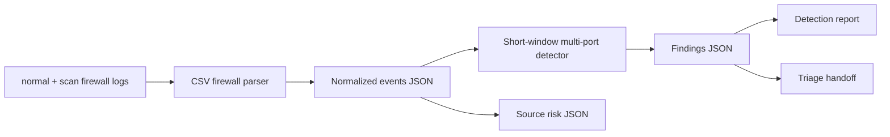

# Architecture

Port Scan Lab is a defensive recon-detection lab for firewall logs.

## Current MVP

- Parses safe synthetic firewall logs.
- Groups activity by source and destination IP.
- Detects many unique destination ports inside a short time window.
- Classifies scan profile and risk.
- Emits events, findings, summary, source risk, detection report, and triage report.

## Future Product Shape

- Configurable thresholds for TCP, UDP, internal, and external sources.
- Allowlist and suppression workflow for approved vulnerability scanners.
- Dashboard charts for scan windows and source IP activity.
